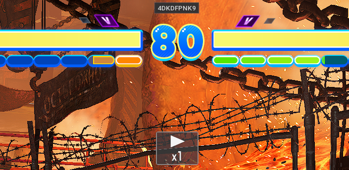
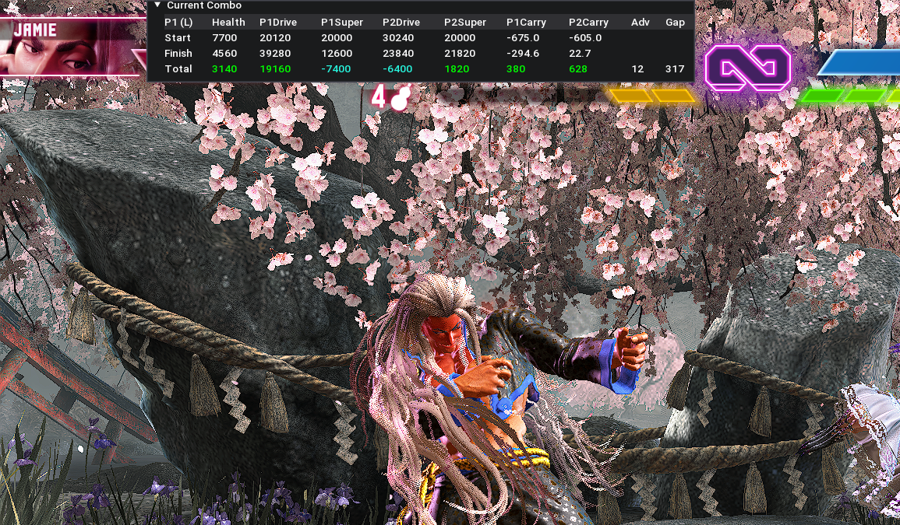
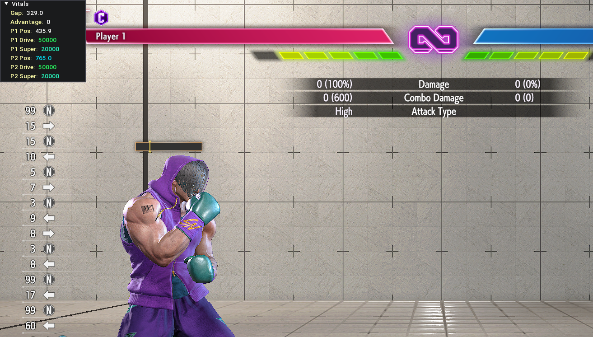

# Street Fighter 6 Mods

## Hitbox Viewer Deluxe

[disp_hitboxes.lua](disp_hitboxes.lua)

Hitbox visualization tool for SF6, an improvement on WistfulHopes' original [hitbox display script](https://github.com/WistfulHopes/SF6Mods).

### Features
- **Legacy Functions**: Everything you loved about the OG WistfulHopes Hitbox script, and more
- **Autosave**: Changed settings are automatically detected and saved to disk, persisting between sessions
- **Halt When Paused**: Hitboxes no longer draw while Training Mode is paused, making menu navigation cleaner and easier
- **Opacity Sliders**: Full opacity customization available for all inner box colors and box outlines
- **Presets**: Easily switch between configs as needed with the ability to create, delete, save, load, and rename presets
- **Easy Restore Defaults**: Quickly discard settings and restore to defaults for P1, P2, or both
- **Streamlined Menu**: Dedicated menu, no longer need to control settings through REFramework's Script Generated UI
- **Intuitive Layout**: Opacity sliders only appear for visible objects. Quickly hide and unhide all P1 or P2 hitbox elements with one click. Change settings in bulk with a mass toggle option and mass opacity slider
- **Hotkey Support**: Quickly hide or show the options menu with a single keypress (currently **F1**)

#### Storage
The script uses `data/disp_hitboxes.json` for storing:
- Current configuration settings
- All user-defined presets
- Active preset

## Replay ID To Clipboard

[replay_id_to_clipboard.lua](replay_id_to_clipboard.lua)

Quickly copy the currently playing Replay ID with a click or hotkey. 

### Usage
* **Ctrl+N**: Copy ID
* **Ctrl+M**: Hide/show ID display

## Combo Data (Beta)

[combo_data.lua](combo_data.lua)

Automatically detects, logs, and analyzes combos. Captures detailed combo data including damage, resource usage, positioning, and knockdown advantage.

### Work in progress
Expect bugs when pausing or loading states frequently in Training Mode, playing back dummy recordings, or when using Replay Mode. May be unreliable in trade situations or when projectile hits are involved. Some features not fully implemented.

### Features
- **Precise Data Snapshots**: Displays values beyond what SF6 offers by default, both at the start of a combo (or single attack) and again when hitstun ends, along with totals showing how much of each resource was gained (or lost) by each player
- **Includes**:
  * **Character** (P1/P2)
  * **Directional Orientation** (P1/P2)
  * **Screen Position** (P1/P2, Start/Finish/Total)
  * **Distance Between Characters** (P1/P2, Finish)
  * **Frame Advantage** (Attacker, Finish)
  * **HP** (Defender, Start/Finish/Total)
  * **Drive Gauge** (P1/P2, Start/Finish/Total - includes passive gains and walk-forward bonus)
  * **Super Meter** (P1/P2, Start/Finish/Total)
- **Logging**: Records and displays combo values in an archived list including time, P1 and P2 characters, damage, Drive and Super gain, and so on. Easily clear stored entries and toggle autosaving with one click
- **Hotkey Support**: Quickly hide or show the Combo Data interface using a single keypress (currently **F2**) without interrupting data logging functionality

### To Do
- **Route Logging**: Converting in-game action IDs to human-readable SF move notation to produce a full, ordered list of each attack used in a given combo
- **Copy/Export Values**: Copy combo values to clipboard or export as JSON, CSV, etc. for easier tech sharing or note-taking
- **Replay Data**: Log metadata for a given replay ID, including player names, MR, character selection, and round/game wins. Allow sorting by player, character, or any matchups thereof
- **Replay Summary**: Display each source of damage in a given replay for easier assessment of strong techniques and individual player tendencies

#### Storage
Creates multiple timestamped JSON files in `data/combo_data/` on a per-session basis.

## Slightly Better Info Display

[info_display.lua](info_display.lua)

A slightly modified version of WistfulHopes' original [info display script](https://github.com/WistfulHopes/SF6Mods) which captures some additional data and adds a new readout display section.

### New Features
- **Vitals Display**: Collection of important information at a glance, including:
    * **Distance between characters**
    * **Frame Advantage**
    * **Screen Position** (P1/P2 - changes colors if in range for DI splat)
    * **Drive Gauge** (P1/P2 - changes colors if in Burnout)
    * **Super Meter** (P1/P2)
- **New Data Tracking**: Adds new values to existing info display sections, including:
    * **Combo Counter**: Counts multi-hit attacks as normal
    * **Combo Attack Count**: Counts multi-hit attacks as single actions
    * **Combo Starter Scaling**:  Shows initial scaling penalty as determined by first attack in combo
    * **Current Hit Scaling**: Shows combo scaling as it continues to decrease throughout a combo
    * **Next Hit Scaling**: Shows expected combo scaling for next hit (actual scaling may be higher if next attack's minimum scaling is higher than current scaling amount)
- **Hotkey Support**: Quickly show/hide the Info Display window with a single keypress (currently **F3**)

## Installation
* Follow instructions to install [REFramework](https://github.com/praydog/REFramework)
* Copy or save .lua file(s) into `reframework\autorun` subdirectory of SF6 install folder
* Launch game
* To disable, open REFramework menu in game, navigate to "ScriptRunner" dropdown, and click on script filename to deselect.

## Thanks
Thanks to [WistfulHopes](https://github.com/WistfulHopes/SF6Mods) for your heroic work on the original Hitbox Viewer and Info Display mods, and for keeping them maintained since SF6 launched. Thanks to [Rabbiratelier](https://github.com/Rabbiratelier/SF6Mods) for Discord help and for your set of very useful mods, which I use constantly and learned a lot from looking through. Thanks to Torino, Yimbo and the rest of the BV crew.
